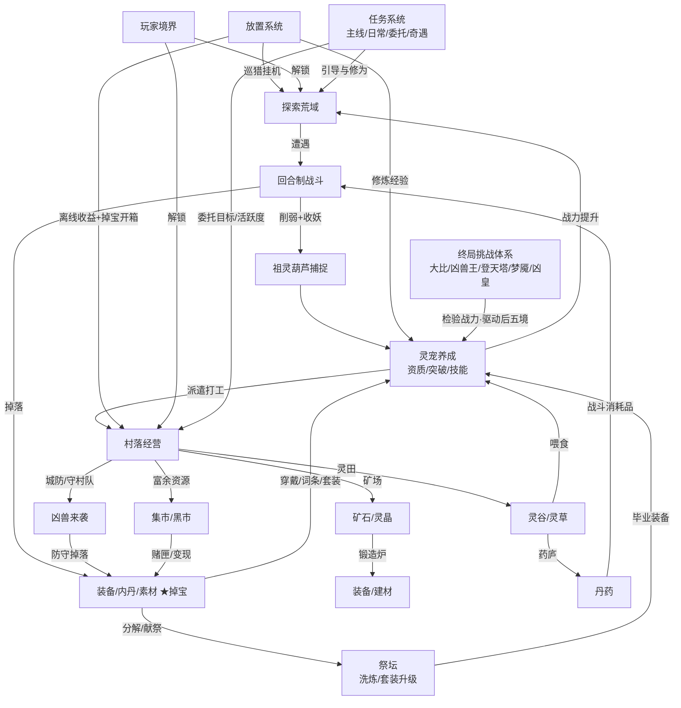

# 《莽荒兽契》整体框架设计文档

> **文档性质**：顶层设计框架（Top-Level GDD），用于统一游戏定位与各系统的边界，后续每个系统再拆分独立详细设计文档。
> **版本**：v0.7 草案
> **日期**：2026-09-08
> **游戏代号**：莽荒兽契（暂定，备选：《荒原御兽师》《莽荒驯兽记》）
>
> **v0.6 → v0.7 修订记录**
> 1. 新增第 20 章**开发维护系统（导表管线与数据流）**：表即唯一数据源——表格结构规范、按模块的全量数据表清单、导表工具选型（Luban/自研）、校验与自动化、版本管理与存档兼容、策划↔程序协作流程
> 2. 原第 20 章（后续文档规划）顺延为第 21 章，新增《12-导表与数据管线.md》子文档
>
> **v0.5 → v0.6 修订记录**
> 1. 第 19 章九项决策**全部定稿**：TapTap 竖屏单机手游·买断制·纯单机、混合美术/音频产能、首发 8~12 只灵宠 + 6 套套装、中度词条深度、后五境纯挑战硬门槛
> 2. 全文同步：1.3 平台形态定稿；删除付费货币"玉璧"（11.1）；集市不做玩家交易（8.7）；荒皇大比对手全 AI 生成（13.2）；弱社交改为社区化替代方案（13.4）；9.3 词条数与红装演出微调
> 3. 版本路线图补充平台里程碑（TapTap 测试位申请与买断上线运营）
>
> **v0.4 → v0.5 修订记录**
> 1. 新增第 16 章**美术整体设计**：视觉风格定位、色彩/五行编码体系、灵宠与场景设计规范、UI/特效/动画规范、资产量估算与生产管线
> 2. 新增第 17 章**音乐音效设计**：骨笛陶埙×部落战鼓的音频风格、场景音乐清单（分层 BGM）、掉宝分级音效、灵宠叫声、混音与制作方式
> 3. 原 16-18 章顺延为 19-20 章（版本规划→18、待定决策→19、后续文档→20），待定决策新增音频制作方式与画面朝向两项
>
> **v0.3 → v0.4 修订记录**
> 1. 新增第 12 章**任务系统**：主线（章节制）/ 境界 / 日常 / 周常 / 村民委托 / 收集 / 奇遇 / 活动八类任务，活跃度宝箱与成就称号体系
> 2. 村民委托接入经营系统（产物订单、灵宠租借、村民好感）；奇遇任务作为稀有宠/橙装之外的第三条入口
> 3. 原 12-17 章顺延为 13-18 章，交叉引用同步更新
>
> **v0.2 → v0.3 修订记录**
> 1. 境界体系拉长为**十境**：前五境（淬体→图腾）解锁全部养成线，后五境（撼山→荒神）每境解锁一种终局挑战
> 2. 后五境推进方式改为**挑战驱动**：突破需达成对应挑战里程碑，修为不再是唯一门槛
> 3. 荒皇大比从图腾境移至撼山境（第六境）；阴阳灵宠、图腾觉醒、套装觉醒收敛至图腾境，确保第五境时养成线全部开放
> 4. 新增五大终局挑战详设（见 13.2）：荒皇大比、四凶兽王讨伐、万兽登天塔、梦魇荒域、太古凶皇决战
>
> **v0.1 → v0.2 修订记录**
> 1. 世界观重构：修仙御灵师/洞府 → **莽荒人类村落求生**，玩家从边陲小村猎手起步，目标是成为莽荒最强者（荒皇大比登顶）
> 2. 模拟经营部分大幅扩充：新增人口与繁荣度、商队集市与黑市、四季与天气、凶兽来袭（村落防御战）、仓储管理、村落图腾战略选择
> 3. 装备系统重做为**暗黑破坏神式掉宝体验**：怪物掉落为主、随机词条、传说威能、未鉴定装备、幸运值
> 4. 新增**套装升级体系**：套装等阶（T1~T5）、套装觉醒、重复件献祭与定向补件

---

## 1. 项目概述

### 1.1 一句话定位

一款以**上古莽荒**为世界观的捉宠养成放置游戏：人类在凶兽横行的洪荒大地边缘顽强求生，玩家扮演村落御兽使，以祖灵葫芦捕捉、驯服凶兽为灵宠，回合制战斗探索荒域，**暗黑式掉宝**刷取词条装备与套装，同时经营壮大自己的村落——派灵宠种田、挖矿、锻造——最终登上万兽荒原的**荒皇大比**，成为莽荒最强者。

### 1.2 对标产品与差异化

| 对标 | 借鉴点 | 我们不做的 |
|------|--------|-----------|
| 宝可梦 / 洛克王国 | 属性克制、捕捉野生宠、回合制战斗、图鉴收集 | 不做即时对战与全国图鉴规模的庞杂数量 |
| 剑与远征 / 放置类 | 离线收益、挂机推图、多线并行养成 | 不做强竞技场抢排名 PvP |
| 江南百景图 / 模拟经营 | 建筑布局、生产链、居民派遣 | 不做重城建，村落规模可控、单屏可管理 |
| **暗黑破坏神（新增）** | 随机词条、套装收集、稀有掉落演出、赌装备 | 不做分钟级大秘境刷刷刷与实时走位操作 |

**核心差异化**：
1. **"捉宠战斗 × 村落生存经营"缝合闭环**——战斗掉内丹养宠物、宠物打工产资源、资源锻造装备反哺战斗，而装备又从战斗中掉落，三环咬死。
2. **暗黑式掉宝放进放置游戏**：挂机也能"开箱"，离线回来结算一屏战利品，稀有掉落光柱冲天——把刷装备的多巴胺移植到碎片时间。
3. **莽荒求生代入感**：村落会遭凶兽袭击、四季天气影响生产、商队定期造访——经营不是挂机数字，而是一个"活着"的村落。
4. 中国上古风味贯穿始终：祖灵葫芦、五行相克、图腾信仰、部落大比。

### 1.3 目标平台与形态（已定，见第 19 章）

- **TapTap（安卓/iOS）竖屏单机手游，买断制**（决策 #1/#2/#9）
- 技术栈：竖屏 H5 引擎（Cocos Creator 等）打包 App；Steam PC 版为远期可选项（需横屏适配评估，不纳入首发承诺）
- 美术方向：2D Q版 + 岩彩/兽骨纹样国风，村落从破败聚落成长为巨石城邦；灵宠立绘三阶段形态差异（详见第 16、17 章）

### 1.4 目标用户

- 玩过宝可梦/洛克王国、有"收集+养成"情怀的 18-35 岁用户
- 偏好放置挂机、碎片时间游玩的上班族
- 喜欢模拟经营"看着数值涨"的休闲玩家
- （新增）有暗黑like刷词条、凑套装习惯的装备驱动型玩家

---

## 2. 核心玩法循环

### 2.1 主循环（分钟级）

```
探索荒域 → 遭遇野生凶兽 → 战斗削弱 → 祖灵葫芦捕捉
     ↑                                    ↓
     │                              灵宠入队/入图鉴
     │                                    ↓
     │                         战利品结算（内丹/装备/素材）★掉宝爽点
     │                                    ↓
资源反哺（灵晶/材料/经验）  ←  村落生产结算（种田/挖矿/锻造）
     ↑                                    ↓
     └──── 装备搭配 / 套装升级 / 技能训练 / 喂食 ←─┘
```

### 2.2 四条并行子循环

| 循环 | 内容 | 节奏 |
|------|------|------|
| **战斗循环** | 推猎径 → Boss → 新荒域解锁 | 小时~天级 |
| **掉宝循环** | 刷精英/Boss/凶兽潮 → 掉装备 → 鉴定/洗词条/凑套装/升阶 | 分钟~周级（贯穿全程的微循环） |
| **经营循环** | 播种/收获、挖矿、锻造、喂食、商队交易、凶兽来袭防守 | 10分钟~小时级，随离线收益结算 |
| **养成循环** | 升级、突破、学技能、配装备配套装 | 天~周级 |

### 2.3 单次会话设计目标

- 一次上线 5-10 分钟可完成：收取离线收益（含掉宝开箱）→ 派遣安排 → 打 2-3 场战斗 → 处理村落事件（商队/凶兽预警）→ 下线
- 长草期内容：词条毕业、套装收集升阶、图鉴收集、灵宠配队研究、荒皇榜挑战

---

## 3. 世界观设定

### 3.1 背景故事（草案）

上古，天倾地裂，灵气如潮涌入洪荒大地。草木沾灵化妖，走兽吞煞成凶。人族孱弱，被万兽逐出沃土，退守高墙之内，以火种与图腾苟延残喘——**此为莽荒纪元**。

相传上古大能炼成**祖灵葫芦**，可摄凶兽、驯灵性，令人兽缔结魂契，与人并肩而战。会驯兽之人，尊称**御兽使**。

玩家是边陲之地**石岭村**的一名年轻猎手。村子在凶兽潮中濒临覆灭之际，玩家于祖祠灰烬中唤醒了尘封的祖灵葫芦，成为村子唯一的御兽使。从此：

- **守住村子**——凶兽潮周期性来袭，村落必须武装起来；
- **壮大部落**——开田、挖矿、锻造，让石岭村从聚落成长为城邦；
- **登顶莽荒**——游历诸荒域，收服凶兽，最终在**万兽荒原的荒皇大比**上击败各部落御兽使，加冕**荒皇**，成为莽荒最强者。

反派与悬念线：四大凶兽王（岁末兽潮的源头）与祖灵葫芦的来历，随版本推进揭开。

### 3.2 玩家境界体系（十境·图腾武道，账号总进度阀门）

玩家的"武道境界"即账号等级，共**十境**，分为性质不同的两段：

- **前五境（淬体 → 图腾）——养成解锁段**：每进一境解锁一批养成系统，至图腾境圆满时**全部养成线开放完毕**（战斗、捕捉、经营、掉宝、技能、套装、阴阳灵宠、图腾觉醒）。此段以修为积累推进，修为来自日常行为（战斗、生产、防守、任务），不设纯刷怪经验。
- **后五境（撼山 → 荒神）——挑战解锁段**：不再解锁新养成系统，每进一境解锁一种**全新终局挑战**；推进方式从"攒修为"切换为"挑战驱动"——突破需达成对应挑战的里程碑（见 13.2），同时每境提升全队全局属性倍率（见 15.1），托平挑战难度曲线。

**前五境：养成解锁**

| 境界 | 层数 | 解锁内容 |
|------|------|------|
| 一境·淬体 | 1-9 重 | 新手引导、捕捉、灵田、兽栏、民居 |
| 二境·凝血 | 初/中/后/圆满 | 锻造炉、装备强化、第二荒域、**凶兽来袭**、城墙箭塔、药庐、仓库 |
| 三境·通脉 | 初/中/后/圆满 | 演武场、灵宠开灵突破、矿场深处、集市与商队、图腾柱、四季与天气 |
| 四境·开窍 | 初/中/后/圆满 | 传承系统、**祭坛（鉴定/洗炼/套装升阶/献祭）**、藏宝洞、异变之地 |
| 五境·图腾 | 初/中/后/圆满 | 村落图腾觉醒、**阴阳灵宠**、套装 T4-T5 与觉醒——**养成线至此全部开放** |

**后五境：挑战解锁**

| 境界 | 层数 | 解锁挑战 | 突破条件（进入下一境） |
|------|------|------|------|
| 六境·撼山 | 初/中/后/圆满 | **荒皇大比**（异步排位） | 大比达到「战酋」段位 |
| 七境·踏荒 | 初/中/后/圆满 | **四凶兽王讨伐**（轮换首领战） | 首杀任意一尊凶兽王 |
| 八境·通天 | 初/中/后/圆满 | **万兽登天塔**（无尽爬塔） | 登天塔突破 50 层 |
| 九境·荒主 | 初/中/后/圆满 | **梦魇荒域**（词缀高难刷宝） | 任意荒域梦魇难度通关 10 层 |
| 十境·荒神 | —— | **太古凶皇决战**（赛季终极挑战） | 击败太古凶皇，加冕荒神，赛季轮回 |

> 后五境的修为需求大幅放缓，挑战里程碑是主要推进动力——玩家的目标感从"解锁新系统"自然过渡为"证明实力"。挑战玩法详情见 13.2。

### 3.3 荒域地图（山海经 × 莽荒风）

每张荒域 = 一类属性产地 + 专属灵宠池 + 猎径关卡链 + 巡猎挂机点：

| 荒域 | 属性倾向 | 代表灵宠（示例） | 特产资源 |
|------|------|------|------|
| 石岭村领地 | 中立 | 灰岩獒（初始宠） | 基础教程资源 |
| 黑风林 | 木 | 桃夭狐、藤蔓妖 | 灵草种子 |
| 赤炎谷 | 火 | 火岩犼、朱羽雉 | 火晶矿 |
| 雷鸣泽 | 金 | 雷纹貂、啸月狼 | 精铁矿 |
| 北冥冰原 | 水 | 玄冰鲤、雪魅 | 玄冰髓 |
| 黄壤坡 | 土 | 石甲貔、地听犬 | 黄壤陶土 |
| 幽暗谷 / 天光崖 | 阴 / 阳（后期） | 待设计 | 待设计 |
| **万兽荒原** | 混合 | 终局内容 | 荒皇大比、四凶兽王、梦魇荒域入口、太古凶皇 |

地图结构：每张荒域 10-20 个关卡节点（猎径）+ 1 个域主 Boss + 巡猎挂机点 + 隐藏精英（高掉落，见 9.7）。

---

## 4. 灵宠系统（核心资产系统）

### 4.1 属性（五行 + 阴阳）

- **基础五行**：金、木、水、火、土，循环相克：金→木→土→水→火→金（箭头为克制方）
- **阴阳双极**（第五境·图腾解锁）：阴⇄阳互克，对五行无克制关系，灵宠稀少且强力
- 克制系数：克制 ×1.5，被克 ×0.75，无关系 ×1.0

### 4.2 品质（稀有度）

| 品质 | 颜色 | 定位 | 获取途径 |
|------|------|------|------|
| 凡兽 | 白 | 过渡宠、**打工主力**（劳作属性高） | 野外捕捉 |
| 灵兽 | 绿 | 前中期战斗主力 | 野外捕捉 |
| 玄兽 | 蓝 | 中期主力，带天赋词条 | 野外稀有刷新/精英掉线索 |
| 荒兽 | 紫 | 后期主力，多天赋 | 域主 Boss 掉落碎片合成/异变之地 |
| 王兽 | 橙 | 图鉴级，专属绝技与形态 | 大型活动、凶兽潮高难防守 |
| 神兽 | 红 | 版本象征宠（极少） | 版本大活动、四凶兽王讨伐 |

**设计原则**：低品质宠不废——凡兽工作加成高（力气大、亲和好），高品质宠战斗强。让"战斗队"与"打工队"使用同一套宠物资产。

### 4.3 基础属性与资质

六维属性：**气血(HP)、攻击、防御、速度、灵力(法攻)、抗性(法防)**

每只灵宠拥有五项**资质**（攻击、防御、体力、速度、灵力），决定升级成长斜率：

```
单级成长 = 种族基础成长 × (资质 / 1000)
资质范围：600 ~ 1400，捕捉时随机roll（可用"洗髓果"重roll）
资质上限受品质影响：凡900 / 灵1000 / 玄1150 / 荒1250 / 王、神1400
```

同种灵宠个体有资质差异 → 捕捉同种宠物有重复价值，符合"捉宠"核心乐趣。

### 4.4 成长阶段（突破 / 进化）

```
幼兽 → 成兽 → 开灵 → 完全体 → 太古体
(1级)  (15级)  (40级)  (80级)   (120级)
```

- 突破消耗：**内丹**（战斗掉落）+ 对应属性素材 + 灵晶
- 每次突破：属性倍率提升、外形巨变（立绘升级）、解锁新技能槽或强化天赋
- 完全体为王兽之路起点（体型暴涨、专属特效），太古体为版本终极形态

### 4.5 性格与天赋

- **性格**（捕捉随机，不可改）：如「暴躁」（攻击+10%，抗性-5%）、「沉稳」（防御+10%，速度-5%），共 8-10 种
- **天赋词条**（玄兽以上随机 1-3 条）：如「火系技能伤害+15%」「夜间战斗速度+20%」「灵田产量+10%」——**部分天赋指向经营系统**，战斗宠与打工宠有交叉价值

### 4.6 图鉴系统

- 收录灵宠解锁图鉴，给永久全局属性加成（微量）与图腾纹章
- 图腾纹章兑换稀有道具、技能书、祖灵葫芦皮肤
- 异色兽（稀有变体）单独收录，是收集党长线目标

---

## 5. 探索与捕捉系统

### 5.1 探索结构

- **猎径推图**：线性节点，每关 1-3 场固定遭遇战，通关解锁下一节点
- **巡猎挂机**：通关荒域后开启，放置产出经验/素材/修为，随机触发"稀有凶兽现身"事件召回玩家
- **异变之地**：周期开放的限时秘境，产出突破素材、稀有宠与高阶装备（重要掉宝场景，见 9.7）

### 5.2 捕捉机制

**核心道具：祖灵葫芦**（品阶：木葫芦 → 铜葫芦 → 玉葫芦 → 祖灵葫芦，品阶影响捕捉率与可捕品质上限）

捕捉规则：
1. 只有**野生凶兽**可捕捉（Boss、凶兽潮守卫不可）
2. 战斗中随时可选"收妖"指令，消耗一次行动回合
3. 捕捉成功率公式（草案）：

```
成功率 = 葫芦基础率 × 品质系数 × 血量系数 × 状态系数 × 等级压制系数

血量系数：目标剩余HP越低越高（HP>50%: 0.3，20-50%: 0.7，<20%: 1.0）
状态系数：目标处于控制/削弱状态时 ×1.5（冰冻、中毒、麻痹、眩晕等）
品质系数：凡1.0 / 灵0.7 / 玄0.4 / 荒0.15（荒兽以上需玉葫芦+保底次数）
```

4. 捕捉失败：目标获得 1 回合怒气（惩罚但不致命），葫芦进入冷却

**捕捉乐趣来源**：血量控制（别打死了）+ 状态技配合（先控制再收）+ 资质赌博（收进来再看 roll 点）

### 5.3 辅助捕捉道具

- 缚兽索：本回合捕捉率 +20%
- 迷魂香：野生凶兽命中率下降，防止其自杀/逃跑
- 高阶驯兽符：对玄兽以上灵宠的必备消耗品

---

## 6. 战斗系统（回合制）

### 6.1 基本规则

- **编队**：出战队 3 只 + 替补 2 只（替补在倒下时入场）；另有**守村队**（第二编队，用于凶兽来袭防守，见 8.9）
- **回合制**：按速度排序行动，每回合每单位行动一次
- **战斗目标**：敌方全灭；野生战斗可选择"捕捉"或"逃跑"
- **自动战斗**：默认开启（放置核心体验），可手动选技能；推图失败提示调整配队/装备

### 6.2 技能体系（每宠）

```
技能槽：4 个
├── 普攻（无消耗，命中+30%概率积攒怒气）
├── 主动技 ×2（各有冷却回合数，如 2/4 回合）
└── 绝技（怒气满 100 释放，威力大 + 专属演出）

伤害来源：物理（攻击结算）或 法术（灵力结算）
```

### 6.3 状态效果（Buff/Debuff）

| 类型 | 示例 |
|------|------|
| 持续伤害 | 中毒（每回合掉血%）、灼烧、腐蚀 |
| 控制 | 冰冻（跳过回合）、麻痹（50%跳过）、眩晕、催眠 |
| 削弱 | 破甲（防御-）、迟缓（速度-）、封技 |
| 增益 | 护盾、蓄势（下次伤害+）、回血、狂暴 |
| 标记 | 灼印（火系技能对目标+30%）等配合型机制 |

**状态技与捕捉联动**：控制/削弱状态提高捕捉率（见 5.2），鼓励常备一只"控制辅助宠"。

### 6.4 速度与先手机制

- 速度决定行动顺序，同速随机；先手价值极高 → 速度资质、性格、装备词条构成配队重要维度

### 6.5 配队策略维度

1. 属性克制轮换（敌方关卡属性公示，鼓励换队）
2. 定位分工：输出（物/法）、坦克（嘲讽/护盾）、辅助（治疗/控制）
3. combo：如「水系冰冻 → 冰系技能伤害加成」「火系灼烧 → 火绝技引爆」
4. 套装驱动流派（见第 9 章）：不同套装让同一只宠走不同流派

---

## 7. 放置系统

### 7.1 离线收益类型

| 类型 | 内容 | 结算 |
|------|------|------|
| 修炼打坐 | 未上阵灵宠在兽栏自动获得经验 | 离线累计，上限 12h（图腾柱可提升至 24h） |
| 巡猎挂机 | 挂机点产出灵晶、素材、修为 | 5 分钟一个 tick，离线照算 |
| 掉宝结算 | 挂机期间击杀的精英/Boss 产出装备 | **离线归来一次性"开箱"演出（见 9.8）** |
| 村落生产 | 灵田生长、矿场开采照常进行 | 离线累计，需上线收取/再播种 |

### 7.2 放置节奏控制

- **快速巡猎券**：立即结算 2h 收益（日常任务与活跃度宝箱产出）
- **收益上限与溢出**：超上限停止累计，提示上线——形成每日 1-3 次回访
- **稀有事件钩子**：巡猎刷出"稀有凶兽现身（限时 30 分钟）"、村落凶兽潮预警，推送召回

### 7.3 放置原则

> 离线只产出"时间型资源"（经验、基础素材、灵晶、**装备掉落**）；**决策型资源**（鉴定结果定向、词条洗炼、套装升阶、突破节点）必须上线操作。放置的是时间，不是选择。

---

## 8. 村落模拟经营系统（差异化核心·扩充版）

### 8.1 村落总览

村落 = 玩家基地，单屏俯视布局（可拖拽摆放建筑），随繁荣度视觉成长：**破败聚落 → 部落 → 石墙城邦**。建筑随境界逐步解锁：

| 建筑 | 功能 | 解锁 |
|------|------|------|
| 议事堂 | 村落等级中枢，限制其他建筑等级上限 | 初始 |
| 兽栏 | 灵宠容量、休息恢复体力、修炼打坐 | 初始 |
| 民居 | 村民人口容量（全局人手加成，见 8.2） | 初始 |
| 灵田 | 种植灵草/灵谷 | 淬体 |
| 矿场 | 派遣挖矿（铁矿、火晶、灵晶） | 淬体后期 |
| 城墙箭塔 | 村落防御值，凶兽来袭防守战 | 凝血 |
| 锻造炉 | 打造/强化/重铸装备 | 凝血 |
| 药庐 | 灵草炼药（战斗消耗品、体力恢复） | 凝血 |
| 仓库 | 资源储量上限（见 8.10） | 凝血 |
| 集市 | 商队定期来访交易、黑市商人 | 通脉 |
| 演武场 | 技能学习/升级（占用真实时间） | 通脉 |
| 图腾柱 | 村落图腾选择（战略 buff）、离线收益加成 | 通脉 |
| **祭坛** | 装备鉴定、献祭分解、套装升级（见第 9 章） | 开窍 |
| 藏宝洞 | 技能书存放、传承 | 开窍 |

### 8.2 村民人口与繁荣度（新增）

- **人口**：民居提供容量，村民通过"流民投奔"事件（繁荣度/防守胜利触发）入村；人口提供**全局生产人手加成**（如每村民 +0.5% 灵田矿场效率），是经营的第二成长轴（第一轴是灵宠派遣）
- **繁荣度**：建筑等级、人口、图腾等级的综合分，决定村落外观阶段与商队规模；繁荣度里程碑给一次性大奖励（人口+1、稀有种子等）
- MVP 简化：村民为数值化人群，不逐个管理；后期版本可引入"有名有姓的村民"事件（猎手、老铁匠带来的特殊加成）

### 8.3 灵宠派遣（打工系统）——经营与养成的桥梁

每只灵宠除了战斗六维，还有三项**劳作属性**：

| 劳作属性 | 影响岗位 | 来源 |
|------|------|------|
| 力气 | 挖矿产量、锻造锤击进度 | 种族基础 + 等级 + 天赋 |
| 灵巧 | 锻造成功率/品质、采集暴击 | 同上 |
| 木灵亲和 | 灵田产量、生长加速 | 同上 |

派遣规则：
- 每个生产建筑可派 1-3 只灵宠，效率 = 基础产出 × Σ劳作属性 × 心情系数 × 人口加成
- **打工消耗体力与心情**：体力随时间消耗，心情随连续工作下降
- 恢复手段：喂食（灵谷做的灵米饭）、休息（回兽栏）
- 劳作属性与战斗属性**部分共享**（等级提升两者都涨）→ 资产不浪费

### 8.4 灵田（种植）

```
选择种子 → 占用田块 → 生长周期（30min ~ 8h 不等）→ 收获
```

- 作物三类：**灵谷**（做食物/恢复体力）、**灵草**（炼药/技能材料）、**灵花**（装饰/礼物，提升灵宠心情）
- 田块数量随灵田等级增加（3 → 12 块）
- 木灵亲和高的灵宠驻田：产量 +10~30%，偶发"变异灵草"（稀有材料）
- **四季与天气影响产量**（见 8.8）

### 8.5 矿场（挖矿）

- 矿场分地层（浅层铁矿 → 中层火晶 → 深层灵晶母矿），逐层解锁
- 派遣挖矿持续产出，力气决定效率；偶发事件：**矿脉富集**（限时奖励）、**惊动地底凶兽**（触发特殊战斗，胜利得稀有宠线索与稀有装备掉落）
- 深层挖矿有塌方风险（可用支护降低）→ 小决策点

### 8.6 生产链（锻造炉与药庐）

把"原材料 → 半成品 → 成品"做成链式加工，灵宠在链上各环节打工：

```
矿石 ──(熔炼)──→ 金属锭 ──(锻造)──→ 装备 / 建筑升级材料
灵草 ──(晾晒)──→ 药粉 ──(炼制)──→ 丹药（战斗/训练/体力恢复）
灵谷 ──(蒸煮)──→ 灵米饭 ──→ 喂食恢复体力与心情
凶兽骨、皮 ──(加工)──→ 骨器/皮甲部件 ──→ 套装升级材料（见 9.6）
```

- 每道工序占用真实时间（放置感来源），可派驻灵宠加速
- 加工产出可上架集市出售（见 8.7）

### 8.7 集市、商队与黑市（新增）

- **商队定期来访**（每 4-8 小时一批，随繁荣度升级为大型商队）：收购玩家的富余资源（灵米饭、金属锭、多余装备），出售稀有种子、图纸、驯兽道具
- **黑市商人**（稀有来访，或凝血后每晚固定时段）：**用兽贝"赌"神秘骨匣**——随机开出未鉴定装备（品质概率上不封顶），这是暗黑式赌博体验的村落入口（见 9.7）
- 装备多余件处理：走黑市变现与祭坛献祭（见 9.9），不做玩家交易（已定纯单机，决策 #3）

### 8.8 四季与天气（新增）

- 服务器时间驱动四季轮转（每季现实 3-7 天），影响全局生产系数：

| 季节 | 灵田 | 矿场 | 特殊 |
|------|------|------|------|
| 春 | 产量 +20% | 正常 | 播种类作物生长加速 |
| 夏 | 正常 | 正常 | 雷雨多，凶兽潮概率+ |
| 秋 | 产量 +30%（收获季） | 正常 | 商队规模+，集市好价钱 |
| 冬 | -50%（休耕） | -30% | 凶兽潮强度+，需提前囤粮 |

- **随机天气事件**（每次上线可能遇到）：降雨（灵田瞬间+产量）、暴雪（矿场停工 N 小时，可派火系灵宠驻场解除）、灵雨（全资源小幅暴涨，惊喜时刻）
- 设计目的：制造"今天该多种/多挖/囤粮"的轻策略与话题性

### 8.9 凶兽来袭（村落防御战，新增·核心生存压力）

- 荒原凶兽周期性冲击村落（每天 1-2 波，冬季与夏雷雨加频），提前 30 分钟预警
- 防御力量 = **城墙箭塔城防值** + **守村队**（独立第二编队，用不上阵的替补宠与打工宠轮换，激活二线阵容价值）
- 防守战为自动回合制（可手动介入），胜利结算：内丹、素材、**装备掉落（重要掉宝来源，随波次等级提升）**
- 防守失败：部分资源被掠（有保护底线），建筑受损需修复——**"顽强生存"的张力来源**，但永不毁档
- 高难波次（周末兽潮/四凶先锋）：王兽碎片与橙装的主要稳定产地

### 8.10 仓储管理（新增）

- 仓库提供各类资源储量上限，升级扩容
- 溢出资源缓慢衰减 → 软压力促使玩家及时加工（熔炼/炼药/锻造）或上架集市出售
- 装备背包独立于仓库，容量宽松 + 自动分解规则（见 9.8）防爆炸

### 8.11 村落图腾（战略选择，新增）

图腾柱建成后，全村信仰一种图腾（可花代价切换）：

| 图腾 | 加成方向 | 适合玩家 |
|------|------|------|
| 狼图腾 | 战斗：全队攻击 +8%，巡猎速度 +10% | 推图/大比党 |
| 熊图腾 | 经营：生产效率 +10%，仓储 +20% | 种田/囤资源党 |
| 鹰图腾 | 掉宝：装备掉落幸运值 +15% | 刷子党 |

图腾等级随使用升级（图腾境后觉醒二段效果），构成账号 build 的一部分。

### 8.12 经营循环小结（资源自循环图）

```
灵田 ──灵谷──→ 灵米饭 ──→ 喂食恢复体力/心情 ──→ 灵宠继续打工
 │                                            ↑
 └──灵草──→ 药庐 ──→ 丹药(战斗/训练)          │
                                            │
矿场 ──矿石──→ 锻造炉 ──→ 装备/建材 ──────────┘
 │                          ↑
 ├──灵晶──→ 全局货币        │
 └──凶兽骨皮──→ 祭坛素材 ──→ 套装升级材料
 
战斗 ──→ 内丹(突破) + 装备掉落(直接穿/分解/献祭)
凶兽来袭 ──→ 防守胜利 → 装备/内丹/素材（压力→奖励循环）
集市/黑市 ←→ 富余资源变现 / 赌神秘骨匣
```

---

## 9. 装备与掉宝系统（暗黑式·重做）

### 9.1 总原则

> **掉落为主，锻造为辅**：装备主要从战斗中掉落（暗黑核心体验），锻造炉负责定向补缺、强化与重铸，而不是唯一产出。每一场战斗都有"可能掉好东西"的期待感。

### 9.2 装备结构

| 部位 | 名称 | 主属性 |
|------|------|------|
| 武器位 | 兽骨兵刃/法器 | 攻击 或 灵力 |
| 防具位 | 兽皮甲/鳞甲 | 防御 或 抗性 |
| 饰品位 | 兽牙链/骨符 | 速度 或 气血 |

- 每只灵宠 3 个装备位（简化，防背包爆炸），装备通用不绑宠，换装自由
- 装备等级 = 掉落时怪物等级（决定基础属性与词条数值区间）

### 9.3 品质与词条（掉宝的第一层多巴胺）

| 品质 | 颜色 | 词条数 | 特效演出 | 定位 |
|------|------|------|------|------|
| 粗坯 | 白 | 0 | 无 | 分解货，自动处理 |
| 良品 | 绿 | 1-2 | 无 | 过渡用 |
| 灵器 | 蓝 | 2-3 | 蓝光 | 中期主力 |
| 宝器 | 紫 | 3-4 | 紫光 | 后期主力 |
| **荒器** | 橙 | 4-5 + **传说威能** | **橙色光柱冲天 + 全村广播** | 流派核心 |
| 神器 | 红 | 6 + 太古威能 | 红光冲天 + 全屏异象演出 | 版本象征 |

### 9.4 词条池与洗炼（掉宝的第二层多巴胺）

- 词条 = 前缀（攻击系：攻/灵/暴击/属伤…）+ 后缀（生存系：防/抗/气血/速度/体力恢复…）随机组合
- 词条数值在区间内随机 roll（如"火系伤害 +6%~15%"）→ 同名装备也有好坏之分，构成"毕业"追求
- 特殊词条池：**劳作词条**（力气/灵巧/亲和 +X，如"采掘+12%"）与**掉宝词条**（幸运值 +X）——装备反哺经营与掉宝本身，三系统再次咬合
- **洗炼**：祭坛消耗兽贝+材料重 roll 单条词条；可锁定 1 条（高消耗），词条毕业是周级长线追求

### 9.5 传说威能（改变玩法的橙装）

荒器/神器带专属**威能**，直接改变技能或规则行为（示例）：

- 「燎原」：你的灼烧效果可叠加 3 层
- 「霜狱」：冰冻命中时，额外冻结 1 回合（Boss 减半）
- 「先祖之魂」：灵宠倒下时，队友获得其 30% 攻击，持续 2 回合
- 「丰饶之角」：装备者驻田时，灵田产量 +25%（战斗宠与打工宠互通的典范）
- 「兽语者」：捕捉成功率 +10%

威能与套装、灵宠技能构成 build 三要素，是后期配队研究的核心素材。

### 9.6 套装系统与套装升级（用户核心诉求）

**套装结构**：每套 = 武器 + 防具 + 饰品 3 件，提供 **2 件套 / 3 件套** 两档效果。套装主题按莽荒部族与凶兽命名，如：

| 套装 | 2 件效果 | 3 件效果（示例） |
|------|------|------|
| 狼魂套装（金） | 速度 +12% | 先手攻击伤害 +40% |
| 雷煞套装（金） | 雷系技能冷却 -1 | 每次暴击积攒 20 怒气 |
| 赤炎套装（火） | 火伤 +15% | 灼烧可暴击，且引爆时溅射 |
| 青木套装（木） | 治疗 +20% | 队友受治疗时获得护盾 |
| 玄冰套装（水） | 冰冻概率 +15% | 对冰冻目标伤害 +50% |
| 厚土套装（土） | 防御 +20% | 受击积攒怒气翻倍 |
| 荒骨套装（狩猎） | 掉落幸运 +20% | 击杀精英必掉宝器 |

**套装升级三件套（祭坛功能，开窍境解锁）**：

1. **等阶升阶（T1 → T5）**：套装按荒域分层（黑风林的 T1 狼皮 → 万兽荒原的 T5 狼神）。在祭坛消耗**重复套装件 + 凶兽精髓**，把现有套装升到下一阶——属性与套装效果数值全面提升，外形纹样进化（狼皮 → 狼魂发光纹）。**保留刷取成果，避免换梯度推倒重来。**
2. **套装觉醒**：集齐 3/3 后可进一步觉醒，消耗觉醒材料（凶兽潮高难掉落）→ 套装效果强化或追加第四条效果 + 装备发光特效
3. **献祭与定向补件**：重复套装件献祭得"套装精华"；差一件毕业时，用精华 + 对应部件图纸**定向打造缺失件**（防"差一只袜子"的挫败，暗黑事故名场面）

### 9.7 掉落机制（数值框架）

**掉落来源系数**：

| 来源 | 掉落系数 | 说明 |
|------|------|------|
| 普通野怪 | ×1.0 | 白绿蓝为主，偶见紫 |
| 精英怪（地图明雷刷新） | ×3.0 | 紫色稳定产出，橙装主要farm点 |
| 域主 Boss | ×8.0 | 首杀必掉紫，橙装保底计数 |
| 凶兽来袭防守 | ×2.0 | 波次等级越高越好，高难波次保底橙 |
| 异变之地 | ×4.0 | 周末限时，全品质上浮 |
| 黑市赌匣 | 特殊表 | 兽贝直购，品质概率独立 |

**幸运值系统**：图腾（鹰）+ 图鉴进度 + 装备词条 + 称号可堆叠"幸运值"，线性提升稀有品质权重——给刷子一个可成长的"爆率面板"。

```
掉率(品质q) = 基础权重(q) × 来源系数 × (1 + 幸运值 / 1000)
装备等级 = 怪物等级(±2 浮动)
词条数值 = 随机roll(区间下限 ~ 区间上限，随装备等级缩放)
```

**未鉴定机制**：蓝及以上品质以"神秘骨匣/未鉴装备"形式掉落 → 祭坛（或一键批量）鉴定后揭晓品质与词条。鉴定是免费的仪式感（暗黑式开箱），不做付费鉴定。

### 9.8 掉宝体验与 QoL（放置游戏必须做好）

- **掉落演出**：稀有度光柱（蓝→紫→橙→红），橙以上全屏特效 + 村落广播
- **离线开箱**：挂机期间积累的未鉴定装备，回归时一次性开箱结算——本作放置侧最大爽点，需专门 UI 演出
- **自动分解规则**：可配置"自动分解白/绿/蓝"，白绿默认分解为锻造石；紫以上进背包待手动处理
- **装备对比**：拾取时与当前穿戴件一键对比，词条差异高亮
- **掉落日志**：本次会话掉落汇总，稀有掉落永久记录在"战利品图鉴"

### 9.9 分解与材料循环

```
白/绿/蓝装备 ──自动分解──→ 锻造石（强化燃料）
紫装备 ──手动分解──→ 锻造石 + 词条结晶（洗炼材料）
橙装备 ──献祭──→ 传说精髓（升阶/觉醒材料）
重复套装件 ──献祭──→ 套装精华（定向补件）
```

装备从"掉落 → 穿戴/分解/献祭 → 材料反哺强化/升阶"全链路有去处，无废物流。

---

## 10. 技能训练系统

### 10.1 技能获取

| 途径 | 说明 |
|------|------|
| 种族自带 | 每种灵宠自带 1-2 个专属技能（不可遗忘，随突破强化） |
| 技能书学习 | 藏宝洞/关卡掉落技能书 → 演武场学习 |
| 传承 | 开窍境解锁：A 宠将已学技能传授给 B 宠，消耗内丹+时间 |
| 套装/威能附加 | 部分套装与传说威能临时改变技能行为（见第 9 章） |

### 10.2 演武场机制（放置化的技能养成）

- 学习/升级技能需**占用训练位 + 真实时间**（如 2h/6h/12h）
- 可指定一名"陪练灵宠"（同属性）缩短 20% 时间
- 技能等级：Lv1-5，每级提升倍率/降低冷却，消耗重复技能书或灵草素材

### 10.3 技能槽管理

- 4 槽位（普攻固定 + 3 自由槽），学新技能需遗忘/替换
- 搭配深度：同宠不同流派（控制流/爆发流/辅助流），套装与威能进一步放大流派差异

---

## 11. 资源与经济体系

### 11.1 货币

| 货币 | 获取 | 消耗 | 定位 |
|------|------|------|------|
| 兽贝 | 日常任务、集市出售、凶兽潮防守 | 喂食、播种、洗炼词条、黑市赌匣 | 软通货 |
| 灵晶 | 巡猎挂机、挖矿、关卡 | 强化、突破、打造、建筑升级 | 硬通货（时间产出） |
| 图腾纹章 | 收录图鉴、异色兽、成就 | 兑换技能书、套装图纸、葫芦皮肤 | 收集转化 |

> **买断制已定（决策 #2）**：无付费货币（原"玉璧"设定移除）；后续付费点为 DLC / 赛季扩展包。

### 11.2 关键材料流

- **内丹**：战斗/防守掉落 → 突破、传承（战斗是养成的发动机）
- **矿石系**：铁矿/火晶/玄冰髓/雷珀 → 金属锭 → 装备、建筑升级
- **灵草系**：清心草/赤焰花/凝神菇 → 药粉 → 丹药、技能升级
- **凶兽骨皮/精髓**：凶兽潮与精英掉落 → 套装升阶与觉醒的核心 gating 材料
- **种子/图纸**：关卡、商队、异变之地掉落 → 扩展经营与锻造内容

### 11.3 经济设计原则

1. 战斗、经营、放置三系统各有独占产出，互相不可替代
2. 装备驱动资源（词条材料、套装精华、凶兽精髓）**只能通过战斗/防守获取**，保证掉宝体验的核心地位
3. 时产资源设每日软上限（防脚本/防毕业过快），集市出售价随供给衰减（防无脑单资源刷钱）

---

## 12. 任务系统

### 12.1 定位与设计目标

任务系统是全游戏的**节奏器与引导器**：

1. **引导**：告诉玩家"现在该做什么"——放置游戏最缺的是下一步目标，任务面板就是常驻的目标面板
2. **燃料**：任务是修为的主要来源之一，支撑前五境推进（见 3.2）
3. **缝合线**：任务目标覆盖战斗、捕捉、经营、掉宝、养成全部系统，把散点玩法串成每日动线
4. **叙事载体**：主线任务承载莽荒剧情（祖灵葫芦来历、四凶兽王、先代御兽使之谜）

### 12.2 任务类型总览

| 类型 | 刷新/节奏 | 内容方向 | 奖励定位 |
|------|------|------|------|
| **主线任务**（章节制） | 永久、线性 | 剧情推进 + 荒域解锁牵引 + 玩法教学 | 大量修为、功能解锁、关键道具 |
| **境界任务** | 每境界一组 | 突破材料收集 + 养成指标达成 | 境界突破资格 |
| **日常任务** | 每日重置（5 条 + 活跃度） | 战斗/经营/养成小目标轮换 | 兽贝、快速巡猎券、活跃度宝箱 |
| **周常任务** | 每周重置 | 导向周玩法（凶兽潮高难、异变之地、凶兽王、登天塔） | 灵晶、材料箱、洗炼材料 |
| **村民委托** | 每日轮换 3-5 单 | 经营向：交付产物、租借灵宠、协助讨伐 | 兽贝、繁荣度、村民好感 |
| **收集/图鉴任务** | 长期 | 捕捉、突破、异色兽、套装收集 | 图腾纹章、稀有道具 |
| **奇遇任务** | 随机触发、限时 | 救治凶兽、神秘旅人、遗迹线索 | 稀有宠线索、橙装入口、剧情碎片 |
| **活动/赛季任务** | 限时 | 节日、版本活动、赛季目标 | 限定外观、套装图纸、称号 |

### 12.3 主线任务（章节制 = 新手轨）

- 每章绑定一张荒域与一段剧情：石岭村危机 → 黑风林 → 赤炎谷 → … → 万兽荒原
- 章节内三类节点：**剧情节点**（对话/演出）、**目标节点**（击败域主、收获首批灵谷等）、**教学节点**（第一次捕捉/锻造/鉴定，嵌在剧情中不突兀）
- 主线进度 ≈ 境界进度互相校准：境界不足时主线提示"提升境界后继续"，避免内容被一口气推穿
- 主线不设体力/次数门槛，卡点只来自养成自然节奏（放置友好）

### 12.4 境界任务（突破的仪式感）

- **前五境**：突破 = 完成境界任务组（收集指定材料 + 达成养成指标，如"任意灵宠达到 X 级""穿戴 3 件灵器"），比纯数值墙更有目标感
- **后五境**：突破 = 挑战里程碑（见 3.2），任务面板直接显示当前挑战的进度条

### 12.5 日常/周常与活跃度

- 日常 5 条，从多系统目标池随机（防单玩法挂机），10 分钟内可清完（对齐 2.3 会话目标）
- **活跃度五档宝箱**（20/40/60/80/100）：末档给快速巡猎券——每日回访的闭环钩子
- 周常指向周玩法，完成周常 ≈ 体验完全部周玩法
- 防呆：日常产出占每日总获取 ≤ 20%，不做"漏一天就亏麻"的强制感

### 12.6 村民委托（经营向任务钩子）

村口**告示板**每日刷新 3-5 单委托，由村民/来访旅人发布：

| 委托类型 | 示例 | 设计意图 |
|------|------|------|
| 交付产物 | "老猎手预定了 10 份灵米饭" | 给生产链一个稳定订单出口 |
| 租借灵宠 | "铁匠想借一只力气大的宠 4 小时" | 期间该宠不可出战/打工，付租金+好感（派遣取舍决策） |
| 协助讨伐 | "流民请求清剿黑风林野猪 ×15" | 战斗与经营互导 |
| 稀有委托 | "神秘访客求购一件宝器" | 装备变现与持有量管理 |

- 奖励：兽贝 + 繁荣度 + **村民好感**；好感等级给对应 NPC 永久小加成（如铁匠好感高 → 锻造成功率 +2%）
- 委托过期无惩罚（放置友好），稀有委托可花兽贝续期

### 12.7 奇遇任务（随机惊喜，打破固定循环）

上线瞬间或巡猎中随机触发，限时完成（1-2 小时）：

- **受伤的王兽幼崽**：救治 → 获得捕捉机会或图鉴进度
- **神秘旅人**：黑市加场 / 出售稀有种子
- **遗迹藏宝图**：一次性小副本，保底紫装
- **凶兽迁徙**：某荒域 2 小时内击杀收益翻倍（钩子拉回战斗）
- **祖灵低语**：祖灵葫芦的碎片剧情（主线悬念的散点投放）

奇遇是稀有宠捕捉与凶兽潮掉落之外的**第三条稀有入口**，给"今天上线看看"一个理由。

### 12.8 成就系统（超长线任务）

- 里程碑成就：捕捉总数、生产总量、套装收集、防守连胜、登天塔层数、梦魇层数等
- 成就点数 → **称号**（带微量属性，如"万兽之友：捕捉 500 只，捕捉率 +1%"）+ 图腾纹章
- 与战利品图鉴（9.8）、灵宠图鉴（4.6）联动展示

### 12.9 任务体验与数值原则

1. 任务主要产出修为、兽贝、定向材料箱——**不做任务独占装备**，保住掉宝核心地位（装备从战斗来）
2. 任务面板常驻侧栏：进行中任务一键追踪、奖励一键领取、红点分级规范
3. 所有任务目标与核心循环重合：做"顺手任务"，不做逼玩家改变玩法的"负担任务"
4. 数值配平细节见《09-任务系统详细设计》

---

## 13. 玩家成长与终局内容

### 13.1 长线进度轴

```
境界(淬体→荒神) = 总进度轴
  ├── 前五境（养成解锁段）：战斗/捕捉/经营/掉宝/技能/套装/阴阳 —— 养成线全部开放
  └── 后五境（挑战解锁段）：
        ├── 战斗线：荒域推图 → 域主Boss → 异变之地 → 四凶兽王
        ├── 掉宝线：词条毕业 → 套装收集(T1~T5全图鉴) → 梦魇荒域终局刷宝
        ├── 收集线：灵宠图鉴 → 异色兽 → 神兽
        ├── 经营线：建筑升级 → 繁荣度里程碑 → 图腾觉醒
        └── 挑战线：荒皇大比 → 凶兽王讨伐 → 登天塔 → 梦魇荒域 → 太古凶皇（"莽荒最强"认证之路）
```

### 13.2 后五境五大终局挑战（详细设计）

| 挑战 | 解锁 | 形态 | 核心产出 | 追求点 |
|------|------|------|------|------|
| 荒皇大比 | 六境·撼山 | 异步排位：挑战各部落御兽使队伍 | 段位奖励、限定套装图纸 | 段位与称号 |
| 四凶兽王讨伐 | 七境·踏荒 | 每周轮换首领战，全村备战 | 凶兽精髓、T5 套装、神兽线索 | 首杀/速杀纪录 |
| 万兽登天塔 | 八境·通天 | 无尽爬塔，每层随机规则词缀 | 爬塔币（兑换稀有道具） | 层数与排行榜 |
| 梦魇荒域 | 九境·荒主 | 已通关荒域的高难词缀版，层数无限 | 终局刷装备核心场景（最高掉率与装备等级） | 词条/套装毕业 |
| 太古凶皇决战 | 十境·荒神 | 赛季终极 Boss，多阶段机制 | 加冕荒神、村口雕像、赛季限定 | 最高荣誉 |

**设计要点**：

1. **五种挑战五种玩法**：排位（对人策略）、首领战（机制应对）、爬塔（规则适应）、词缀刷宝（build 检验）、决战（版本叙事收束），避免终局体验同质化。
2. **挑战驱动突破**：后五境每境突破 = 对应挑战的里程碑达成（见 3.2 表），养成（装备/套装/灵宠）直接服务于挑战通关，形成"刷 → 强 → 更高层"的正循环。已定**纯挑战硬门槛、无修为软兜底**（决策 #7）——荒皇含金量最高，但挑战难度曲线与养成上限的配平列为《02-数值设计》最高优先级课题。
3. **梦魇荒域是掉宝终局**：怪物等级随层数无限提升 → 装备等级同步上浮，词条数值有持续成长空间，配合幸运值体系构成暗黑式终局刷取；每层随机 2-3 条词缀（如"敌方全体速度+30%""火系免疫"）逼迫玩家准备多套 build 与多属性灵宠。
4. **荒皇大比**（"成为莽荒最强选手"的官方认证）：与各部落御兽使异步对战——对手由系统按玩家战力动态生成（纯单机，决策 #3；对手阵容来自预置的"御兽使图鉴"并随版本扩充），无实时操作压力；**段位：猎手 → 战酋 → 荒主 → 荒皇**，每赛季结算，荒皇雕像立于村口；赛季奖励限定套装、神兽线索、称号。
5. **凶兽王与村落联动**：讨伐备战期间凶兽潮强度提升，防守胜利为讨伐积攒"备战值"（全村增益），村落经营与终局战斗联动，打工队与守村队也参与终局。
6. **登天塔规则轮换**：每 5 层换一组规则词缀（如"速度反转""技能冷却+1""治疗减半"），考验阵容广度而非单一强度，塔币商店提供定向补强道具。

### 13.3 日常/周常框架（任务类型与活跃度详见第 12 章）

- 日常：收取离线（含开箱）、播种收获、推图 10 关、喂食、处理商队（约 10 分钟）
- 周常：凶兽潮高难波次、异变之地、凶兽王轮换、登天塔冲刺
- 赛季（后五境开启后）：荒皇大比结算、梦魇荒域层记录刷新、太古凶皇决战
- 版本：新荒域 + 新灵宠 + 新套装等阶 + 四凶兽王图鉴推进

### 13.4 社交替代方案（纯单机）

- 已定纯单机（决策 #3）：不做异步村落拜访、真人快照与实时对战
- 社交以**社区化**替代：TapTap 论坛/晒图 culture、成就与村落分享卡片、荒皇加冕截图生成器
- 排行类内容以"个人纪录"呈现：登天塔最高层、梦魇最深层、凶兽王速杀纪录

---

## 14. 系统关联总览



**设计自检**：每个系统至少 1 个输入源 + 1 个输出去向，无孤岛系统；装备系统拥有最多的输入（战斗/防守/黑市/锻造）与输出（穿戴/分解/献祭），是掉宝体验的枢纽。

---

## 15. 核心数值框架（草案）

> 仅为公式骨架，具体数值在《02-数值设计》与《08-装备掉落与词条设计》中展开配平。

### 15.1 宠物属性

```
最终属性 = (种族基础值 + 等级 × 种族成长 × 资质系数) × 突破倍率 × (1 + 性格加成) + 装备属性
```

境界全局倍率：每突破一个大境界，全队全属性 ×1.15（暂定）；后五境该倍率同时用于托平五大挑战的难度曲线。

### 15.2 伤害公式

```
伤害 = 攻/灵 × 技能倍率 × 克制系数(1.5/0.75/1) × (1 - 防御减免) × 暴击系数 × 随机浮动(0.9~1.1)
防御减免 = 防御 / (防御 + K × 等级)   [K 待配平，目标减免上限 ~70%]
```

### 15.3 捕捉率（见 5.2）

### 15.4 放置与经营产出

```
巡猎时产 = 基础值 × (1 + 图腾柱加成) × (1 + 荒域进度加成)
打工效率 = 基础产出 × Σ劳作属性 × 心情系数(0.5~1.2) × 建筑等级系数 × (1 + 人口加成) × 季节系数
```

### 15.5 掉落与装备（新增）

```
掉率(品质q) = 基础权重(q) × 来源系数(见9.7) × (1 + 幸运值/1000)
橙装保底：域主Boss 20次必出 / 凶兽潮高难 10波必出
套装升阶消耗：Tn→Tn+1 需 重复件×2 + 凶兽精髓×N（N 随阶陡增）
洗炼消耗：第m次洗炼 = 基础兽贝 × 1.15^m（防无限刷）
```

### 15.6 战斗时长目标

- 普通野怪：3-5 回合；精英：5-8 回合；域主 Boss：8-12 回合（有阶段机制/弱点窗口）
- 凶兽潮防守：10-15 回合波次制

---

## 16. 美术整体设计

### 16.1 视觉风格定位

关键词：**上古莽荒 × Q版国风 × 岩彩质感**。

| 层面 | 风格取向 |
|------|------|
| 「荒」在场景 | 粗粝岩石、兽骨图腾、原始巨植被——危险与野性 |
| 「萌」在角色 | 2.5~3 头身 Q 版灵宠——收集品的亲和力 |
| 「炫」在特效 | 高饱和五行光效——战斗与掉宝的爽点担当 |

- 质感语言：岩彩颗粒、彩陶纹样、青铜/兽骨图腾纹；内部参照系：三星堆纹样、《山海经》异兽图谱、仰韶彩陶
- 一句话风格锚点：**"在野兽横行的荒原上，一群圆滚滚的凶兽"**——反差萌是记忆点

### 16.2 色彩体系（全局编码）

| 用途 | 规范 |
|------|------|
| 全局底色 | 莽荒大地色：土褐、岩石灰、兽骨白（场景与 UI 的基底） |
| 五行属性色 | 金=鎏金黄 / 木=翠绿 / 水=湛蓝 / 火=赤红 / 土=赭黄 |
| 阴阳 | 阴=紫黑 / 阳=鎏金白 |
| 品质色 | 白粗坯 → 绿良品 → 蓝灵器 → 紫宝器 → 橙荒器 → 红神器（与 9.3 一致） |
| **信息系统分离** | **属性色用于图标底色，品质色用于边框与光效**——两套并行，绝不混用（玩家扫一眼即读出"什么属性×什么稀有度"） |

### 16.3 灵宠设计规范

**阶段形态差异**（对应 4.4 突破链，立绘必须可辨识升级）：

| 阶段 | 视觉特征 |
|------|------|
| 幼兽 | Q 版圆润、比例夸张、无威胁感 |
| 成兽 | 野性特征发育（獠牙/角/爪），体型拉长 |
| 开灵 | 出现灵纹、局部发光、眼神智慧化 |
| 完全体 | 体型暴涨、专属特效部件、王兽光环 |
| 太古体 | 全身图腾纹样、光环常驻、形态质变 |

- **属性外显规则**：五行特征落在固定部位（角/爪/皮毛/尾部）——火系=赤羽余烬、水系=鳞片湿雾、雷系（金）=电弧纹，保证"看图猜属性"成立
- **剪影优先原则**：先剪影后细化，战斗小人尺寸下必须可辨识种族
- 品质外显：王兽以上带专属光环图案；异色兽=色相偏移 + 特效换色
- 生产规格：每只 = 立绘 × 3 阶段 + 战斗小人；**Spine 骨骼动画**，骨架家族化复用（四足/飞行/爬行/人形四类基础骨架）控制成本

### 16.4 场景设计

- **村落**：三阶段外观（破败聚落 → 部落 → 石墙城邦）× 四季换装（雪覆/花开/落叶）× 昼夜光照；建筑单体语言 = 木石结构 + 兽骨装饰 + 图腾柱
- **荒域**：每域一个主环境色 + 标志地貌——黑风林=浓雾巨树、赤炎谷=熔岩裂谷、雷鸣泽=雷暴湖泊、北冥冰原=极光冰原、黄壤坡=黄土沟壑；关卡背景以"地标变体"复用降本
- **万兽荒原**：五行元素混搭 + 巨兽骸骨堆，终局压迫感
- 氛围层：远景视差 + 天气粒子（雨/雪/落叶/余烬），构成"活着"的莽荒

### 16.5 UI 设计规范

- **材质语言**：按钮 = 石板浮雕、面板 = 兽皮/木板、装饰 = 骨珠/羽毛/绳结/图腾纹、强调色 = 火把橙
- 布局原则：常驻信息极简（村落单屏 + 任务侧栏），二级界面深度收纳——放置游戏界面多，克制是美德
- 两个重点定制界面：**掉宝开箱结算屏**（本作第一爽点界面，开箱节奏与光效分级）与**装备对比浮窗**（词条差异高亮）
- 朝向：竖屏（已定，决策 #9，TapTap 竖屏单机）

### 16.6 特效规范（VFX）

- 技能特效**模板化生产**：五行色系 × 物理（碎岩冲击）/法术（符文光效）两类模板，控制规格
- 重点演出（按优先级排序）：

| 演出 | 规格 |
|------|------|
| **掉宝光柱**（第一优先级） | 蓝/紫=竖光 → 橙=粗光柱+震屏+村落广播 → 红=全屏红光+天降异象；与 17.3 掉宝分级音效严格绑定 |
| 收妖葫芦 | 吸入呼啸 → 葫芦摇晃 → 成功"叮"金光 / 失败"噗"灰烟 |
| 突破 | 灵纹逐一点亮 → 形态变换白闪 |
| 凶兽潮预警 | 全屏边缘红光 + 图腾警示纹 |
| 荒皇加冕 | 雕像落成 + 全村小人欢呼（终局荣誉演出） |

### 16.7 动画规范

- 灵宠动作集：待机 / 物理攻击 / 法术攻击 / 受击 / 倒下 + **打工三件套**（锄地/镐击/锤击简化版）——经营场景的灵宠也要"活着"
- 村民：通用小人骨架 + 换装（猎手/农夫/铁匠/商人）
- 骨骼动画为主（Spine），关键剧情节点少量逐帧提升质感

### 16.8 资产量估算与生产管线

| 资产 | Phase 0 | Phase 1 | Phase 2 | Phase 3-4 |
|------|------|------|------|------|
| 灵宠立绘 | 8 只 × 1 阶段 | 20 只 × 2 阶段 | 40 只 × 3 阶段 | 60+ 只含异色 |
| 场景 | 1 | 4 | 8 | 10 + 变体 |
| UI 套件 | 核心框架 | 全系统 | 换肤主题 | 赛季主题 |
| 特效 | 20 | 80 | 200 | 350+ |

- 管线：**风格指南文档先行** → 立绘/场景外包 + 内部组装整合；灵宠骨架与战斗手感特效内部制作
- 外包管理：每类资产先做 1 个"标定样本"验收通过后再批量下单

---

## 17. 音乐音效设计

### 17.1 音频风格定位

关键词：**骨笛陶埙 × 部落战鼓 × 洪荒空鸣**。

- 乐器池：骨笛/陶埙/口弦（旋律层）、太鼓/战鼓/铃鼓（节奏层）、编钟/石磬（点缀层）、低频人声吟唱（萨满感）、自然环境声（风声/虫鸣/兽吼）
- **放置特化原则**：旋律性弱、氛围感强——长时间循环不腻；情绪高潮留给战斗、掉宝与终局演出
- 与美术共用同一参照系（上古洪荒、原始部落），音画一体

### 17.2 音乐场景清单

| 场景 | 风格 | 技术要点 |
|------|------|------|
| 主菜单 | 埙 + 吟唱，苍凉开场 | 首包必带 |
| 村落 | 温暖治愈，四季变奏 | **分层 BGM**：3-4 个乐器层随繁荣度逐层淡入 |
| 荒域挂机 | 环境音 + 轻旋律 | 低存在感；检测挂机状态自动压低音量 |
| 战斗（普通） | 轻快鼓点 | 短循环 |
| 战斗（Boss/凶兽潮） | 战鼓 + 号角 | 强节奏、可加吟唱层 |
| 荒皇大比 | 部落竞赛感、崇高 | — |
| 登天塔/梦魇荒域 | 神秘 + 压迫 | 可按层数渐强（可选） |
| 太古凶皇决战 | 史诗终章，全编制 | 版本主题曲级投入 |
| 商队/奇遇事件 | 异域风短 jingle | 一播性，听个响 |

### 17.3 音效清单与设计原则

- **技能音色五行区辨**：金=金属铃震 / 木=木质弹拨 / 水=水纹涟漪 / 火=爆裂噼啪 / 土=闷雷滚石；物理与法术两类底噪声区分打击感
- **掉宝分级音效（第一优先级定制，与 16.6 光柱绑定）**：
  - 白绿 = 轻扫音 → 蓝紫 = 上行音阶 → **橙装 = 低沉钟鸣 + 光柱轰鸣（"传奇音"，全体玩家的条件反射级记忆点）** → 红装 = 全屏异响 + 兽吼
- **收妖葫芦**：吸入呼啸 → 摇晃 → 成功"叮" / 失败"噗"——捕捉系统的听觉商标
- 经营音效：播种/收获/镐击/锻造锤击（灵巧暴击时变调升 key，小惊喜）/ 商队铃铛
- **灵宠叫声**：每族一条识别音，幼年/成年变调；捕捉成功必播——收集的听觉记忆
- UI 音效：石板叩击（按钮）/ 领取叮当 / 红点警示 / 开箱
- 成长音效：突破灵纹音、境界突破号角

### 17.4 混音与技术方案

- **五通道独立控制**：BGM / 环境音 / 战斗 SFX / 经营 SFX / UI 音
- 优先级抢占：红装掉落 > 橙装掉落 > 击杀 > 技能 > 普通 UI 音（爽点时刻绝不被覆盖）
- 包体控制（TapTap 客户端）：BGM 按场景懒加载，首包只带主菜单 + 村落曲；统一压缩规格与体量预算（详见《11-音乐音效设计》）
- 后台策略：切后台 BGM 淡出；推送/召回音可独立开关

### 17.5 制作方式（已定：混合方案，决策 #8）

- 关键曲目与音效定制外包 + 循环场景曲 AI 辅助生成 + 人工精修 + 通用音效采购库改编
- **不可妥协的定制清单**：掉宝分级音效、收妖葫芦音、村落四季曲、凶兽潮号角、灵宠叫声——这五项是体验的听觉商标

---

## 18. 版本规划与开发路线

### Phase 0 —— 核心原型（可玩性验证，约 6-8 周）

- 1 张荒域（黑风林，木系）、5-8 种灵宠
- 回合制战斗（3v3、五行克制、捕捉）
- 基础掉落（白绿蓝，无词条或单词条）+ 最简挂机 + 存档
- 简版主线任务（串联捕捉-战斗-掉落循环的引导轨）
- 美术风格小样：1 张场景 + 3 只灵宠立绘（锁定画风，见第 16 章）
- 平台动作：TapTap 开发者注册、测试位申请（供原型限量测试）
- **验证目标**：捕捉+战斗+掉装备的循环是否好玩

### Phase 1 —— MVP（闭环成型）

- 品质/资质/突破、性格系统；装备词条（蓝紫）+ 强化
- 首发内容量：灵宠 8~12 只、套装 6 套（决策 #5）；TapTap 限量测试收集反馈
- 村落基础：议事堂、兽栏、民居、灵田、矿场、城墙箭塔 + 简版凶兽来袭
- 3 张荒域、图鉴系统、主线前几章、日常任务与村民委托、离线掉宝开箱
- 美术音频基础包：村落三阶段外观与四季换装、UI 全框架、村落主题曲与掉宝分级音效
- **验证目标**：村落生存感 + 每日回访动力

### Phase 2 —— 掉宝与经营深化

- 祭坛（鉴定/洗炼/献祭）、套装 T1-T3、套装升阶与定向补件、传说威能
- 集市商队与黑市赌匣、四季与天气、生产链（锻造炉/药庐全链）、仓储
- 演武场、技能书与传承、异变之地、5 张荒域
- 奇遇任务与成就系统
- 美术音频全量：五行特效模板、橙红装光柱演出、分层村落 BGM、灵宠叫声库
- **验证目标**：刷词条凑套装的长线留存

### Phase 3 —— 挑战终局（上）

- 图腾境内容收尾：阴阳灵宠、套装 T4-T5 与觉醒、村落图腾觉醒——**前五境养成线全部开放**
- 撼山境：荒皇大比排位（异步）+ 赛季任务框架
- 通天境：万兽登天塔
- 终局演出：大比/登天塔专属音乐与光效、赛季 UI 主题
- **验证目标**：养成线开放完毕后，"证明实力"的目标感是否接得住

### Phase 4 —— 挑战终局（下）与长线运营

- 踏荒境：四凶兽王讨伐；荒主境：梦魇荒域（词缀刷宝终局）
- 荒神境：太古凶皇决战、神兽、赛季体系、弱社交（村落拜访）
- 四凶兽王与太古凶皇 Boss 演出、荒皇加冕演出、赛季主题曲
- TapTap 买断上线：定价策略与首发运营；DLC/赛季扩展包评估

---

## 19. 关键决策（已定稿）

> 九项决策于 2026-09-08 全部敲定，相关章节已同步更新；如需变更须回写本章并评估影响范围。

| # | 决策点 | 结论 | 理由与影响 |
|---|--------|------|------|
| 1 | 平台 | **TapTap（安卓/iOS）竖屏单机手游**；Steam PC 版为远期可选（需横屏适配评估） | 竖屏适配碎片时间；TapTap 支持买断制、零分成、独立游戏社区文化好；放弃微信小游戏（无法上架买断制） |
| 2 | 商业化 | **买断制**（一次性买断 + 远期 DLC/赛季扩展包） | 数值不被付费深度绑架，掉宝与养成可放开做；无付费货币（玉璧移除，11.1）；黑市赌匣不可付费加速 |
| 3 | 联网形态 | **纯单机**（本地存档，无服务器） | 与买断制自洽、零运营成本；荒皇大比对手全 AI 生成（13.2）；无玩家交易（8.7）；社交改社区化方案（13.4） |
| 4 | 美术产能 | **混合：AI 辅助 + 关键外包** | 灵宠立绘 AI 打底+人工精修统一风格，主视觉 5-8 张外包定制；内容量规划（16.8）以此产能为准 |
| 5 | 首发内容量 | **Phase 1 首发 8~12 只灵宠 + 6 套套装** | 五行每系 2 只保证克制教学成立；6 套套装覆盖两档配装流派 |
| 6 | 掉宝词条深度 | **中度：蓝 2-3 / 紫 3-4 / 橙 4-5 / 红 6** | 刷子有毕业追求，放置玩家不被词条海吓退（9.3 已同步） |
| 7 | 后五境卡点 | **纯挑战硬门槛**（无修为软兜底） | 荒皇含金量最高；挑战曲线与养成上限的配平是《02-数值设计》最高优先级课题，防卡关流失 |
| 8 | 音频制作 | **混合方案**（与美术产能策略一致） | 五项听觉商标（掉宝分级音/收妖音/村落四季曲/凶兽潮号角/灵宠叫声）定制，其余 AI+精修与采购库改编（17.5） |
| 9 | 画面朝向 | **竖屏**（并入决策 #1） | 全部 UI/场景按竖屏构图（16.5）；村落单屏布局按竖屏比例设计 |

---

## 20. 开发维护系统（导表管线与数据流）

### 20.1 定位与目标

一句话：**"表即唯一数据源"**——所有游戏数值、配置、文案以电子表格（Excel/CSV）维护，经导表工具转换为程序文件；策划不碰代码，程序不碰数值，表格结构就是双方的沟通接口。

| 目标 | 说明 |
|------|------|
| 沟通标准化 | 策划↔程序接口 = 表结构定义；字段中文注释即需求文档，口头约定必须落进注释行 |
| 效率 | 改数值不改代码，导表分钟级生效；数值迭代节奏与版本解耦 |
| 质量 | 校验器把错误拦截在导表阶段（引用悬空、概率越界、权重为零） |
| 维护 | 表与存档版本化；DLC/赛季内容 = 加行加表，老存档自动兼容 |

### 20.2 导表管线流程

```
策划填写 Excel/CSV ──────┐
                        ├→ 导表工具（校验 + 转换）──→ 输出物 ×3
表结构定义（字段/类型）──┘          │
                                   ├── ① 数据文件：JSON（开发期可读可 diff）/ 二进制（发布包体小）
                                   ├── ② 代码定义：TypeScript 类型声明（d.ts / 目标语言结构体）
                                   └── ③ 检查报告：校验错误清单 + 平衡性报表
                                              │
                                   客户端运行时加载 + 自动化冒烟测试
```

### 20.3 表格结构规范（表即文档）

每个 sheet 固定表头，程序读前 3 行，策划看第 4 行：

| 行 | 内容 | 示例 |
|----|------|------|
| 1 | 字段名（英文，程序用） | `atk` |
| 2 | 类型 | `int` |
| 3 | 可见性标记 | `c`（导出到客户端）/ `s`（仅内部） |
| 4 | 中文注释（策划文档） | 攻击力基础值 |
| 5+ | 数据行 | … |

- **命名规范**：表名 PascalCase（`PetBase`），字段 camelCase（`growRate`）；主键统一 `xxxId`
- **类型系统**：`int / float / bool / string / enum（枚举集中定义）/ array<T> / struct（嵌套）/ ref<T>（跨表外键，导表时校验存在性）`
- **禁止事项**：合并单元格、跨表公式、中文字段名（工具无法解析）

### 20.4 全量数据表清单（按模块，"各个数据以表格形式处理"的落地）

> 清单在此为框架级索引，字段字典全量展开见《12-导表与数据管线》。**每张表必有 Owner 与中文注释行。**

| 模块 | 表名 | 用途 | 关键字段示例 | Owner |
|------|------|------|------|------|
| 全局 | `GlobalConst` | 全局常数与功能开关 | key, value, desc | 主数值 |
| 全局 | `Text` | 全部文案集中管理（i18n 预留） | textId, zh, note | 剧情 |
| 境界 | `RealmConfig` | 十境层数与解锁内容 | realmId, layer, unlockSys[], breakthroughReq | 系统策划 |
| 境界 | `RealmTask` | 境界突破任务组 | realmId, taskId[], materialCost | 任务 |
| 灵宠 | `PetBase` | 种族基础：属性/资质范围/品质/属性系 | petId, name, element, quality, baseStats, growth | 灵宠策划 |
| 灵宠 | `PetBreak` | 突破链五阶段：消耗与属性倍率 | petId, stage, cost[], mult | 灵宠策划 |
| 灵宠 | `PetSkillPool` | 种族技能池与习得等级 | petId, skillId, learnLv | 灵宠/战斗 |
| 灵宠 | `PetSpawn` | 野外刷新权重与捕捉修正 | mapId, petId, weight, captureMod | 灵宠策划 |
| 战斗 | `SkillConfig` | 技能：倍率/冷却/怒气/目标选择 | skillId, type, power, cd, rageGain | 战斗策划 |
| 战斗 | `BuffConfig` | 状态效果：类型/时长/生效参数 | buffId, kind, duration, effects | 战斗策划 |
| 战斗 | `StageConfig` | 关卡：怪组引用/掉落引用/推荐战力 | stageId, waves[], dropId, power | 关卡策划 |
| 战斗 | `EnemyGroup` | 敌人编成（等级与资质 roll 范围） | groupId, enemy[] | 关卡策划 |
| 掉宝 | `DropRule` | 掉落规则：品质权重/来源系数/保底 | dropId, source, weights[], pityCount | 掉宝策划 |
| 装备 | `EquipBase` | 装备基础：部位/等级/主属性区间 | equipId, slot, lv, mainStat | 装备策划 |
| 装备 | `AffixPool` | 词条池：前后缀分组/数值区间/权重 | affixId, group, min, max, weight | 装备策划 |
| 装备 | `EquipSet` / `SetBonus` | 套装与 2/3 件效果、T1-T5 等阶 | setId, tier, bonus[] | 装备策划 |
| 装备 | `PowerConfig` | 传说/太古威能（挂脚本钩子） | powerId, desc, scriptHook | 装备/程序 |
| 经营 | `Building` | 建筑等级、消耗与产出 | buildId, lv, cost[], output | 经营策划 |
| 经营 | `Crop` / `Mine` / `Recipe` | 作物/矿层/生产链配方 | cropId, growTime, yield… | 经营策划 |
| 经营 | `DispatchRule` | 劳作属性→效率公式的系数 | statId, coeff | 主数值 |
| 经营 | `SeasonWeather` | 四季与天气系数表 | seasonId, farmMod, mineMod, events[] | 经营策划 |
| 经营 | `BeastTide` | 凶兽潮波次：强度/奖励掉落引用 | waveId, power, rewardDropId | 关卡/经营 |
| 任务 | `MainQuest` / `DailyPool` / `CommissionPool` / `AdventurePool` / `Achievement` | 八类任务与成就 | questId, type, goal, reward[] | 任务策划 |
| 经济 | `ShopList` | 商队/黑市货单与定价 | shopId, goods[], price, stock | 经济策划 |
| 挑战 | `ArenaRank` / `TowerFloor` / `NightmareAffix` / `BossConfig` | 大比段位/登天塔/梦魇词缀/Boss | rankId, floor, affixGroup… | 终局策划 |
| 音画 | `AudioMap` / `FxMap` | 音效/特效资源与事件映射 | eventId, assetPath | 音频/美术接口人 |

### 20.5 导表工具选型（Phase 0 内定稿）

- 方案 A：**Luban**（开源导表框架，国内主流）——C# 定义 + Excel 数据，输出 json/bin/lua/ts 与代码，自带数据校验
- 方案 B：**自研轻量 Node 脚本**——xlsx → JSON + d.ts + 校验规则，灵活但需自维护
- 输出策略：开发期 JSON（可读、可 Git diff），发布期二进制（包体小、加载快，适配 TapTap 客户端）
- 导出物管理：走 Git 入库或 CI 产物流水线，二选一随工具定

### 20.6 校验与自动化（把数值错误拦在导表时）

| 层级 | 规则示例 |
|------|------|
| 结构校验 | 类型匹配、必填项、主键唯一、表头模板合规 |
| 引用校验 | 所有 `ref<T>` 外键存在：技能 ID、掉落 ID、文案 ID、奖励道具 ID 可达 |
| 规则校验 | 概率 ∈ [0,1]、权重和 > 0、等级区间合法、消耗非负 |
| 平衡报表 | 导表时自动生成等级-战力曲线、掉率期望表——数值评审依据（对接《02-数值设计》） |
| 冒烟测试 | 导出后自动验证：主线任务链可达、所有关卡敌人存在、商店条目有货、掉落表非空 |

### 20.7 版本管理与存档兼容（长线维护核心）

- 表走 Git 分支，改动与版本号绑定；每张表附 changelog sheet 记录变更
- **ID 永不复用、永不物理删行**——废弃行打 `deprecated` 标记（防 DLC 合并冲突与存档引用悬空）
- **存档只存实例数据**（ID、等级、词条 roll 值），不快照配置；表结构变更按存档版本号迁移
- DLC/赛季 = 新增表行与表，配合 ID 规范老存档自动兼容

### 20.8 策划↔程序协作流程（沟通的正式接口）

1. **新增字段/表**：策划提需求 → 程序定类型与默认值 → 策划填数据 → 导表校验 → 双方 review 表 diff
2. **表结构变更**（改类型/删字段）：必须程序评审（涉及运行时代码适配），数据行增删则策划自决
3. **注释即需求**：字段中文注释行是唯一权威说明，任何口头/IM 约定必须回写注释
4. **异步评审**：以导表校验报告 + 平衡报表替代对表会议，只在版本节点做集中 review

### 20.9 与开发阶段的衔接

- **Phase 0**：定稿工具（Luban/自研）与表头模板，先建 8 张核心表（`PetBase / SkillConfig / StageConfig / DropRule / EquipBase / Crop / MainQuest / GlobalConst`）跑通管线
- **Phase 1**：全量表铺开，校验器接入 CI，changelog 规范生效
- **Phase 2+**：平衡报表驱动数值迭代；DLC 表规范试运行

---

## 21. 后续文档规划

> **状态（2026-09-08）**：下表 02~12 全部子文档已产出 v0.1 初版，进入随导表 CI 平衡报表持续配平阶段。

| 文档 | 内容 |
|------|------|
| 02-数值设计.md | 属性成长表、伤害/捕捉/产出公式配平、等级-战力曲线 |
| 03-战斗系统详细设计.md | 技能效果全集、状态机、AI 策略、速度轴、凶兽潮波次规则 |
| 04-灵宠图鉴数据结构.md | 种族数据表、资质范围、技能池、突破链、劳作属性 |
| 05-村落经营详细设计.md | 建筑数值、生产链产出表、人口/繁荣度、四季天气表、凶兽来袭波次设计、商队黑市货单 |
| 06-经济与产出配置.md | 货币产出/消耗总表、每日资源流模拟 |
| 07-技术架构.md | 客户端框架、数据表驱动方案、存档与热更新 |
| 08-装备掉落与词条设计.md（新增） | 品质权重表、词条池全表、套装 T1-T5 数据、威能列表、幸运值配平、掉落演出规范 |
| 09-任务系统详细设计.md（新增） | 主线章节与脚本结构、任务目标类型参数、村民委托池、奇遇事件表、活跃度与奖励配平 |
| 10-美术设计规范.md（新增） | 风格指南、色彩/五行编码表、灵宠三阶段设计规范、场景/UI/特效/动画规范、资产清单与产能表 |
| 11-音乐音效设计.md（新增） | 曲目清单与分层 BGM 方案、五行音色表、掉宝分级音效规范、灵宠叫声表、混音与加载策略 |
| 12-导表与数据管线.md（新增） | 表头模板与类型系统细则、全量表清单与字段字典、Luban/自研选型对比、校验规则库、CI 接入、存档迁移与 DLC 表规范 |

---

*本文档为框架草案，各系统细节以子文档为准；框架层面的修改需回写本文档并更新版本号与修订记录。*
